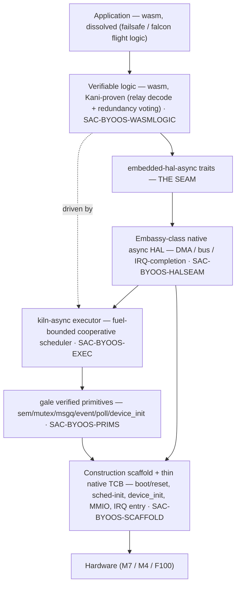
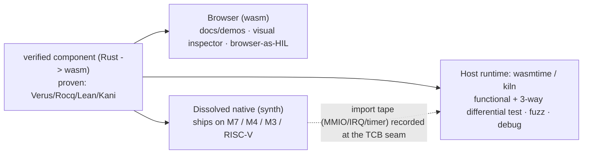

# gale build-your-own OS (BYO-OS)

> The reframe (gale#74): **gale is not "verified Zephyr primitives" — it is a library of
> composable, formally-verified OS components.** Drop them into an existing OS, *or* build
> your own. `gust` proved the second mode; this is its generalisation.

## Two modes, one component library

| mode | what it is | proven by |
|------|-----------|-----------|
| **Drop-in** | gale replaces an existing OS's C kernel primitives in place (`zephyr/*.c`) | 36 QEMU kernel-test suites + wasm-dist modules (sem/mutex/msgq) |
| **Build-your-own** | compose gale primitives + kiln-async + async HAL + wasm bodies into a bespoke OS — no Zephyr | `gust` boots on bare Cortex-M3 (`gale#65`) |

The payoff jess wants (Pixhawk 6X-RT): in build-your-own mode **the C disappears** — no Zephyr,
no NuttX/PX4, no NXP-SDK C drivers. The flight trusted base becomes **verified Rust (gale + kiln
+ HAL) + wasm (Kani-proven drivers + falcon)**: one language discipline, one verification story
end-to-end (Verus/Rocq/Lean + Kani), the smallest auditable trusted base.

## The layer cake

**The verification boundary IS the wasm/native seam.** Everything *above* `embedded-hal-async`
is verifiable logic → wasm (proven + dissolved). Everything *below* is timing/DMA/privileged
state you cannot easily prove → the trusted native substrate. That is the same boundary `gust`
drew for its sync MMIO shim, generalised to async + DMA.

## Answers to the three asks (gale#74)

### 1. First-class build-your-own mode? — **Yes.**
gust already proves it works on bare metal. Make it first-class via a **construction crate**
(`SAC-BYOOS-SCAFFOLD` / `REQ-BYOOS-CRATE-001`): the `plain/` gale primitives + kiln-async + a
minimal reusable scaffold (reset/boot, scheduler-init, `device_init` ordering), no Zephyr. gust's
hand-rolled cortex-m-rt superloop becomes the reference minimal instance, factored into hooks —
so a new target is "pick components + provide the TCB shim", not "re-hand-roll the OS".

### 2. Are `device_init` / `work` / `poll` the right hooks? — **Two yes, one no.**
- **`device_init` — yes.** It is the verified bring-up-ordering primitive; it is the construction
  scaffold's device-init hook.
- **`poll` — yes.** Its verified waitable-set readiness logic maps onto async readiness/select;
  kiln-async's `waitable-set`/`stream` already echo `k_poll`. Reuse it for the readiness layer.
- **`work` — no (redundant).** kiln-async *is* the executor; a Zephyr-style workqueue on top of
  it duplicates it. Deferred work is a kiln-async task.
- **The driver framework itself is a thin NEW layer** (`SAC-BYOOS-HALSEAM`), anchored on
  `embedded-hal-async`, hosted on kiln-async — not routed through `work`.

### 3. Positioning "composable OS components (drop-in or BYO), C-free"? — **Yes, and accurate.**
Both modes are *proven* (drop-in: 36 suites + wasm-dist; BYO: gust). The README story shifts from
"verified Zephyr primitives" to **"composable verified OS components — drop into an existing OS,
or build your own; C-free Rust + wasm."** This matches the gust/jess trajectory (DD-006 maximal-wasm
/ DD-011 gust / DD-017 M7 = gale-maximal-wasm) and is the Bytecode-Alliance-resonant framing.

## The driver model (the sophisticated piece)

gust's driver model is a trivial ~4-item sync shim. The M7 needs the real thing — DMA, async
completion, multiple isolated buses, redundancy. The substrate (`REQ-BYOOS-DRV-001`):

- **Seam:** `embedded-hal-async` (standard async embedded-HAL traits).
- **Native host substrate:** Embassy-class async HAL (bus transport + DMA + IRQ-completion) —
  "drivers as host components, driven down". IRQ handlers wake kiln-async tasks via `Waker`.
- **Executor:** kiln-async (already Embassy-inspired — task arena + waker-as-index).
- **Verifiable logic stays wasm:** relay's Kani-proven protocol decode + redundancy voting sit
  *above* the async traits.

Enabler: the **MIMXRT1176 CMSIS-SVD** (NXP official, BSD-3-Clause, cm7+cm4) → `svd2rust` PAC for
the HAL foundation **and** Renode `ApplySVD` for the hermetic HIL — one artifact unblocks both
the real-silicon HAL and emulation, M7 and M4.

## One OS, three scales (`REQ-BYOOS-SCALE-001`)

The same component set targets **M7 (falcon, full async-DMA stack) / M4 (sensor-I/O offload) /
F100 (gust, ~4-item sync TCB)** by varying only the TCB shim and the synth `--target`. Proven in
miniature: the gust kernel re-synths from one `.wasm` to **cortex-m3 AND riscv32**.

## Honest open rigor (inherited from gust, at async scale)

The async HAL substrate (Embassy-class) is the **trusted, not-proven** layer — timing/DMA. It
carries the same gaps gust surfaced, now at async scale:
- **WCET of the native substrate** (IRQ entry/exit + DMA-completion latency) is outside the fuel
  model — bound separately (cf. `FIND-GUST-002`).
- **IRQ→waker concurrency** (the cross-context wake) needs a lost-wakeup/torn-read proof
  (cf. `FIND-GUST-003`).
- **The synth toolchain in the TCB** — trust/qualification story (cf. `FIND-GUST-004`).

These are tracked as gust findings and apply identically to the BYO-OS driver framework.

## wasm as the universal lifecycle substrate (not just a build IR)

Because gale authors components as wasm and dissolves them to native *only at the end*,
the wasm is the substrate for the **whole lifecycle** — one formally-verified artifact,
three runtimes:

- **Browser** — run a component (or a whole gust) unmodified in a browser: interactive
  docs, a steppable scheduler/ring-buffer inspector, browser-as-HIL against a simulated
  peripheral. (`FIND-BYOOS-002`)
- **Host (wasmtime / kiln)** — already shipping: the wasm-testbed runs `wasmtime --invoke`
  + the 3-way wasmtime/unicorn-arm/rv32 differential. Fast functional test, fuzzing, and
  host debugging of the *same* component that ships. (`REQ-BYOOS-MULTIRT-001`)
- **Dissolved native** — `synth` to bare metal, ships.

The neighbours can't do this: the dissolved-native field (aWsm) *discards* the wasm; the
on-device-runtime field (WAMR) keeps an interpreter and *never dissolves*. gale keeps both
forms of one verified artifact (see `DOC-BYOOS-MARKET`).

### The debug superpower: record on HW, replay in wasmtime (`FIND-BYOOS-003`)

The wasm/TCB **import seam is narrow and is exactly where all non-determinism enters** —
the verified logic above it is deterministic. So the seam is a natural **record-replay cut**:
capture the tape of import values on hardware (MMIO reads, IRQ/timer events, bus bytes),
replay it into the *same* wasm component in wasmtime/browser, and re-execute bit-identically.
A hardware heisenbug (an M7 DMA race, or a sleepy wohl node where JTAG/printf is painful)
becomes a steppable, time-travel-debuggable host session.

**The elegant part: the record-replay cut == the verification cut.** A replay that diverges
from the proven component's behaviour localizes the fault to the **native TCB** (the declared
unverified part) or to **unmodeled hardware** — *never* to the verified logic. record-replay
(rr, Pernosco) and embedded trace (Tracealyzer, SystemView) exist, but as x86 time-travel or
trace-*view*; deterministic re-execution of the same verified, dissolvable component at the
verification seam is the unoccupied combination. (`REQ-BYOOS-REPLAY-001`)

## Second vertical: wohl (home automation) (`STKH-WOHL-001` / `FIND-BYOOS-004`)

Drones and home automation share the BYO-OS value, with wohl emphasising **cost + battery**:
the smallest dissolved footprint on the cheapest MCU, a **fuel-bounded scheduler whose bound
makes wake/sleep timing predictable** (so the node sleeps maximally and deterministically —
a direct battery win), and **OTA where the update unit is a signed, re-verifiable wasm
component**. Same component library, scaled down — widening gale from safety-critical into
cost/power-critical. (`REQ-WOHL-001`)
