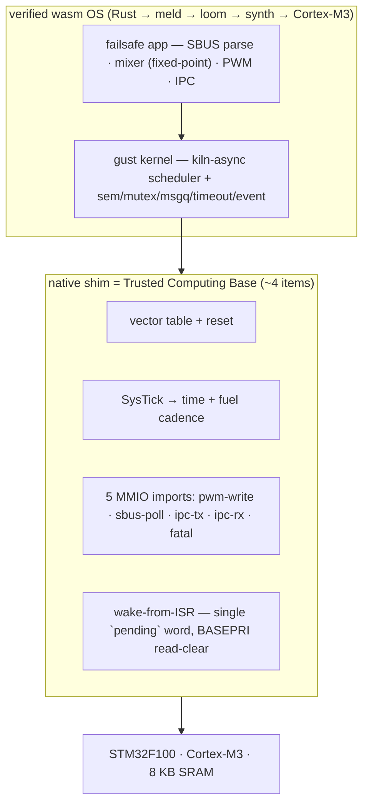
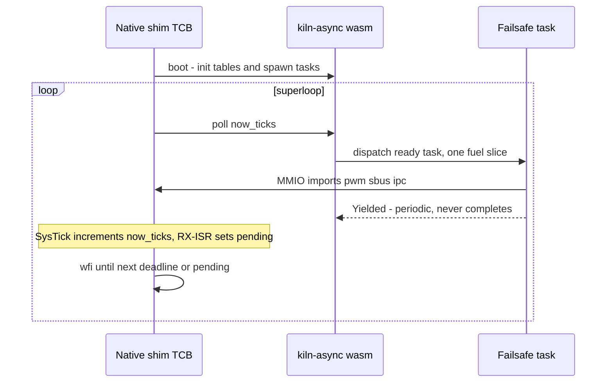
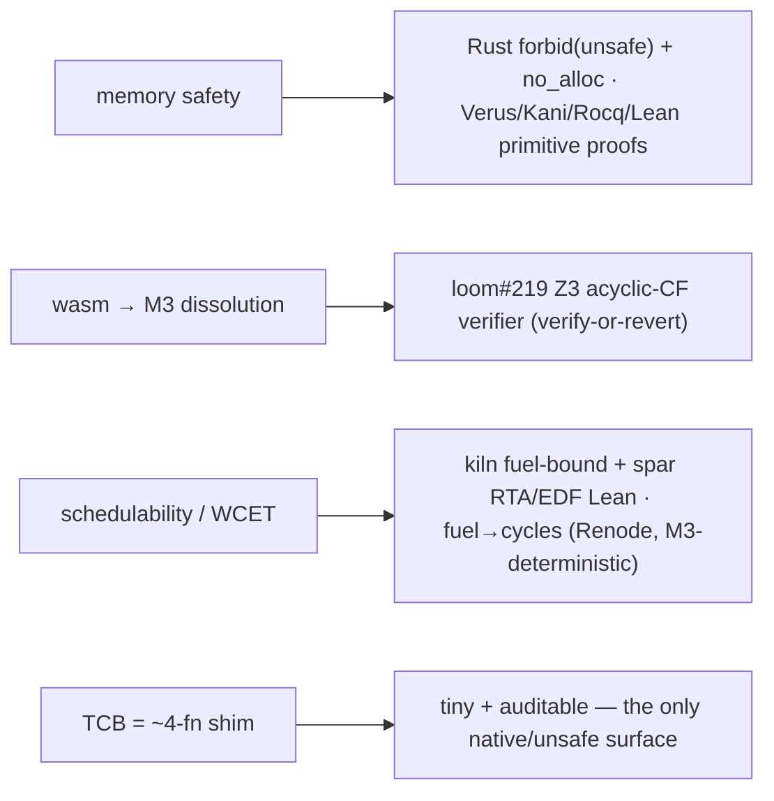

# gust — a maximal-wasm mini-RTOS for tiny bare-metal nodes

> **gust** = the smallest gale (Beaufort 7, 28 kt): the `gale` toolchain's world, carried to the smallest node.

**Target:** STM32F100 (Cortex-M3, 8 KB SRAM) — the px4io-class failsafe I/O node (jess #65 / REQ-PIX-009).

## The promise

gust **inverts the RTOS trust model**. A conventional tiny RTOS (px4io, NuttX) is a
native-C kernel you trust wholesale. gust makes the **kernel itself wasm** — scheduler
+ primitives compiled to the target through the *verified* `meld → loom → synth` chain — and
hand-writes only a **~4-function native shim**. The trusted computing base (TCB) collapses
from "the whole firmware" to **"4 functions + a separately-verified compiler."**

The result is a tiny RTOS that is, by construction:
- **memory-safe** (Rust `forbid(unsafe)` + `no_alloc`; primitives carry Verus/Kani/Rocq/Lean proofs),
- **WCET-provable** (kiln-async is fuel-bounded; the fuel unit is the same one spar's RTA/EDF Lean proofs use ⇒ schedulability is a *proof*, not a stress test),
- **dissolution-verified** (loom's Z3 acyclic-CF verifier proves the wasm→M3 compile is semantics-preserving — loom#219),
- with a **~4-function native TCB**.

## Architecture — the layer cake & TCB boundary

## The boot/poll superloop (the TCB contract in motion)

## What's proved, and by which oracle

> The acyclic-CF property loom#219 verifies is **load-bearing for WCET**, not just an
> optimization: bounded fuel-per-path requires no back-edges. Same constraint, two payoffs.

## Measured status (bring-up — honestly scoped)

**Boots on Cortex-M3** (qemu `lm3s6965evb`): `boot()` → SysTick superloop → `poll()` runs the
kiln-async scheduler + a fixed-point-mixer failsafe task for 5000 stable rounds, clean exit.

### Memory footprint (vs the F100's 8 KB SRAM)
| item | size |
|---|---|
| FLASH (`.text`+`.rodata`, the OS code) | ~5.1 KB |
| static RAM (`.bss`) | 20 B |
| scheduler working set `Scheduler<6,6,4,2,2>` | **376 B** |
| `SchedConfig` | 16 B |
| ⇒ OS state ≈ **0.4 KB RAM** | **~7.5 KB of 8 KB free** for app + stack + buffers |

### WCET / fuel→cycles
Method: run the same ELF on Renode `stm32vldiscovery` (real STM32F100, M3) and read
`sysbus.cpu ExecutedInstructions` over the run. Because Cortex-M3 has no cache/branch-predictor,
Renode's instruction count ≈ silicon cycles ⇒ a deterministic **fuel→cycles** calibration that
turns the abstract schedulability proof into a wall-clock WCET. Robot authored
(`benches/gust/renode/gust_f100.robot`); calibration number pending a Renode run.

### Synth-gap op-set (what the wasm OS needs from the backend)
Profiled (op-set scans): the **scheduler substrate** and the **failsafe app** clear all four
on-target synth gaps (#275 dispatch / #369 float / #372 i64.load-store / #180-185 bulk-mem)
**iff the mixer is fixed-point**. #372 already cleared in synth v0.11.47. A float mixer pulls
only #369. So gust is synth-gap-free on v0.11.47 with a fixed-point mixer.

## Honest caveats / roadmap
1. The scheduler is currently compiled **native thumbv7m** — not yet through `meld→loom→synth`
   (the maximal-wasm version is the next integration; this proves the OS *logic* on-target).
2. `kiln#338` (`no_alloc` gating `kiln-error/recovery.rs`) is **stubbed** with a Noop allocator
   to link; the failsafe path never allocates. Must land for a clean image.
3. SysTick needs qemu `-icount` to advance (qemu virtual-time artifact); native on the F100 (Renode).
4. The native shim has a WCET the fuel model does **not** cover (ISR + MMIO worst-case) — bound separately.

Build/run: `benches/gust/run-qemu.sh` (local) · `renode-test renode/gust_f100.robot` (F100).
